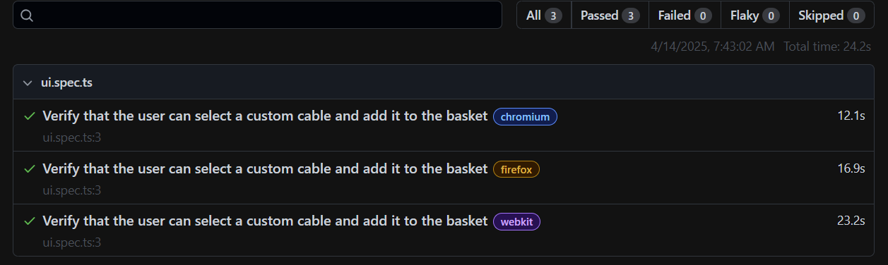

# 🎯 Objective
Automate a user journey on the Thomann Cableguy webpage using Playwright. The test simulates a user selecting random cable models and types, then verifies product selection and cart behavior.

## 🧪 Test Scenario Overview
The automation scenario consists of the following steps:

### 🔹 Step 1: Select Cable Beginning
- Navigate to the Cable Beginning section
- Select a random Cable Type
- Select a random Cable under the chosen type

### 🔹 Step 2: Select Cable End
- Navigate to the Cable End section
- Select a random Cable Type
- Select a random Cable

### 🔹 Step 3: Choose Manufacturer
- Select a random Manufacturer
- Verify that the number of displayed products matches the number shown beneath the manufacturer's logo

### 🔹 Step 4: Open Product Page
- Click on one of the filtered products
- Verify that the correct product detail page opens

### 🔹 Step 5: Add to Basket
- Add the selected product to the shopping basket
- Verify that the Basket Notification Popup shows correct product information

## 🚀 Technologies Used
- Playwright
- TypeScript
- Page Object Model (POM)

## 📁 Project Structure
```
THOMANN-QA-TASK
├── fixtures/
│   └── Fixtures.ts                 # Test fixtures for shared setup
├── pages/                          # Page Object Models
│   ├── Cablespage.ts
│   ├── Homepage.ts
│   └── ProductPage.ts
├── tests/
│   └── ui.spec.ts                  # Main test spec
├── .env                            # Environment variables (STORE_URL)
├── playwright.config.ts           # Playwright config
├── package.json
├── package-lock.json
└── README.md
```

## 🛠️ Installation
```
git clone https://github.com/username/playwright-ui-tests.git
cd playwright-ui-tests
npm ci
```

## ▶️ Run Tests
```
# Headless mode (default)
npx playwright test

# Headed mode (visible browser)
npx playwright test --headed

# Specific browser
npx playwright test --project=chromium     
```
- Test results screenshot


## 📊 View Report
- The HTML report is opened automatically after the test run. This behavior is set in open property in the Playwright config.
```
npx playwright show-report
```

## ✅ Best Practices Applied
### 🔄 Page Object Model (POM)
- UI interactions are encapsulated in modular page classes for a clean separation of test logic and DOM interactions.
- Improves test scalability, maintainability, and reusability.

### 🧩 Fixtures
- Used to initialize page objects and manage shared test context.
- Helps reduce code duplication and streamline repetitive code.

### 🌍 Environment Variables
- Local development uses a .env file for easy configuration.
- GitHub Actions environments used in CI for separating deployment-level values.

### 🎯 Locators & Assertions
- Utilized Playwright's built-in locators for robust, auto-waiting element handling.
- Adopted web-first assertions, allowing Playwright to wait until conditions are met before proceeding—resulting in more stable and reliable tests.

